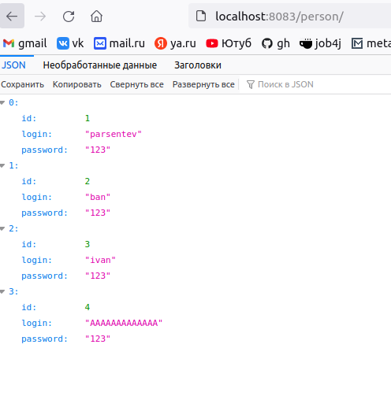
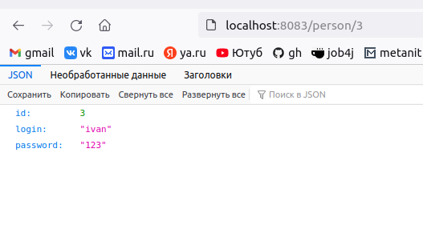
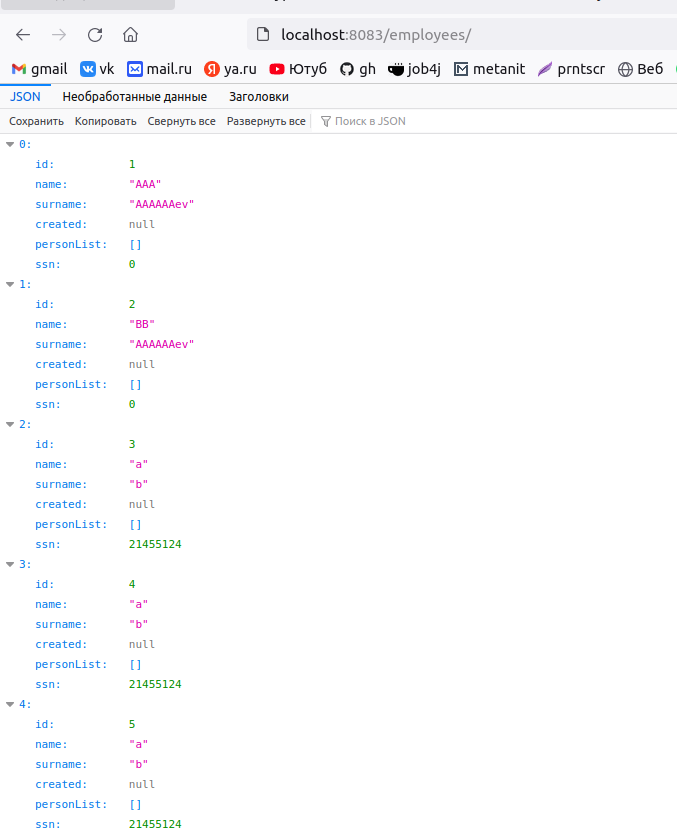

## job4j_auth

 Перекидываемся жсонами, персон
 
 Перекидываемся жсонами, персон id
 
 Перекидываемся жсонами, employees
 
### Контакты для связи 
 arvikvan@gmail.com 
 @ArvikV

###Используемые технологии:
- Maven
- Hibernate
- PostgreSQL
- Travis CI
- Apache Tomcat
- Spring MVC, Security, Boot
- REST

